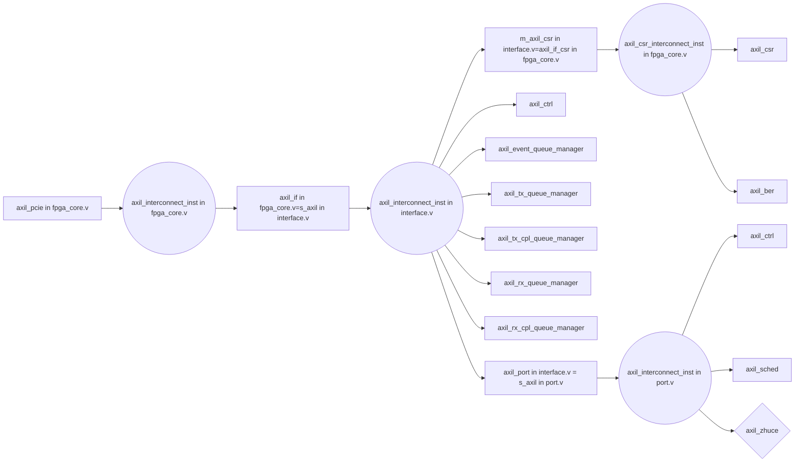

# 作者
QQ群：**852283276**
微信：**arm80x86**
微信公众号：**青儿创客基地**
B站：[主页 `https://space.bilibili.com/208826118`](https://space.bilibili.com/208826118)

# Xilinx AXI Ethernet
```bash
# Documentation/devicetree/bindings/net/xilinx_axienet.txt
This driver supports following MAC configurations-
a) AXI 1G/2.5G Ethernet Subsystem.
b) 10G/25G High Speed Ethernet Subsystem.
c) 10 Gigabit Ethernet Subsystem.
d) USXGMII Ethernet Subsystem.
e) MRMAC Ethernet Subsystem.

AXI 1G/2.5G Ethernet Subsystem- also called  AXI 1G/2.5G Ethernet Subsystem,
the xilinx axi ethernet IP core provides connectivity to an external ethernet
PHY supporting different interfaces: MII, GMII, RGMII, SGMII, 1000BaseX.
It also includes two segments of memory for buffering TX and RX, as well as
the capability of offloading TX/RX checksum calculation off the processor.

Management configuration is done through the AXI interface, while payload is
sent and received through means of an AXI DMA controller. This driver
includes the DMA driver code, so this driver is incompatible with AXI DMA
driver.

MRMAC is a hardened Ethernet IP on Versal supporting multiple rates from
10G to 100G which can be used with a soft DMA controller.
```
tso，
```bash
save_wave_config D:/project/pcierc-zc706-axi-interconnect/tso.wcfg
open_wave_config D:/project/pcierc-zc706-axi-interconnect/tso.wcfg
```
多了一行
  assign ip_src_addr_be = s_axis_tdata[47:16];
  
# mppr
> [Varint编码](https://www.cnblogs.com/jacksu-tencent/p/3389843.html)
> [整数压缩编码 ZigZag](https://www.cnblogs.com/en-heng/p/5570609.html)
> [ZigZag 与 反ZigZag编码](https://my.oschina.net/tigerBin/blog/1083549)

FPGA解压缩后整数要按照大端模式发送到网络上，
> [大小端及网络字节序](https://blog.csdn.net/z_ryan/article/details/79134980)
> [关于网络字节序](https://blog.csdn.net/zhaojiangwei102/article/details/4532184)

- FIELD_INCREMENT_HEAD包含数据data12，根据data12找到是哪个静态数据，如果没有这个字段则后面的数据忽略，等待下一个UDP包
- FIELD_INCREMENT_VALU，同一个组合域里面可出现多次该数据类型，做Incrementdata42操作，首先得到st_data_calua数据结构，
- `FIELD_INCREMENT_TINFO`等需要FPGA计算浮点数乘法，浮点数的表示方法，目前来看都是int64*double，输出double，后发现Xilinx有相关转换IP，在Math Functions下面的Floating-point中，DSP48E可用于加减乘除运算，Floating-point还有直接使用DSP48E计算加减乘除的功能，采用两个Floating-point IP，一个定点转浮点，加上一个双精度浮点乘法即可

> [verilog中对浮点数的处理](https://blog.csdn.net/bleauchat/article/details/100024750)
> [FPGA浮点数定点数的处理](https://www.cnblogs.com/Dinging006/p/9450577.html)
> [verilog 浮点数转定点数_FPGA浮点数定点数的处理](https://blog.csdn.net/weixin_28912709/article/details/112934737)
> [verilog中的定点数、浮点数、定点小数、定点整数的表示及运算](https://blog.csdn.net/woshiyuzhoushizhe/article/details/105920861)
> [verilog 浮点转定点_定点数和浮点数](https://blog.csdn.net/weixin_39779537/article/details/111279559)
> [Xilinx怎么定点数转浮点数](http://www.elecfans.com/pld/703134.html)
> [Xilinx大神都懂的数字运算单元—DSP48E1](http://xilinx.eetrend.com/content/2020/100049181.html)
> [DSP48E1详解-2](https://blog.csdn.net/abcdef123456gg/article/details/103709480)

1. ST_DATA_HEAD等结构体没有加`__attribute__((packed))`，这个在不同编译器下会不会出问题？你们用的什么编译器，gcc？visual studio？
2. pcap文件第32314/45361个包的ST_DATA_HEAD->fieldSize为负值（是否是`__attribute__((packed))`的问题？），导致指针溢出。
3. Incrementdata42的作用是什么，函数写的比较复杂，我检索了整个600MB的pcap文件，没有调用这个函数。

20210219
varint解码必须等待上一个varint解码完成才可以，因为varint需要输入的数据是变长的，需要遍历数据解码后才能获知需要的数据长度，FIELD_INCREMENT_VALU类型的解码比较特殊，首先跳过了2个字节才开始varint解码，后面代码中`phead += data_head.fieldSize - nlen;`，即把数据消耗量强制对齐到data_head.fieldSize，而其他类型没有这个操作，varint解码出消耗多少字节就是多少，这里有特殊的设计吗？比如可以让data_head.fieldSize在每种类型的解码里都代码数据总消耗量。若想让解码性能达到最好，需要软硬件协同优化，同时，如果FPGA设计完成，软件就不能轻易改动了，可能会造成FPGA设计完全作废，架构需要重新设计。我这里先按照Demo软件的设计。
`pmkt->data10*pmkt->data7`可由驱动计算好写入静态数据包的最后。

调试机，`task=0x1`，
```bash
$ ssh test@192.168.2.227
$ sudo lspci -vv -s 01:00.0
$ sudo lspci -vv -d 1994:0828
$ sudo modprobe uio && sudo insmod pcie_chipset.ko
$ dmesg | grep pcie_chipset
[ 1002.151418] pcie_chipset: loading out-of-tree module taints kernel.
[ 1002.151472] pcie_chipset: module verification failed: signature and/or required key missing - tainting kernel
[ 1002.152038] pcie_chipset: Mar  1 2021 - 22:40:26
[ 1002.152067] pcie_chipset 0000:01:00.0: vendor[0x1994], device[0x0828], subvendor[0x1994], subdevice[0x1994], class[0x20000]
[ 1002.152070] pcie_chipset 0000:01:00.0: enabling device (0000 -> 0002)
[ 1002.152178] pcie_chipset 0000:01:00.0: dma_set_mask_and_coherent 32bit success
[ 1002.152179] pcie_chipset 0000:01:00.0: BAR0, start=0xf6000000, end=0xf6ffffff, len=0x1000000, flags=0x40200
[ 1002.152190] pcie_chipset 0000:01:00.0: auto find ucode, offset=0x0
[ 1002.152240] pcie_chipset 0000:01:00.0: ucode addr is 00000000d804518d[auto], origin addr=0000000066e3fb95
[ 1002.152241] pcie_chipset 0000:01:00.0: ucode version is 20210418.8064200
[ 1002.152242] pcie_chipset 0000:01:00.0: modules number is 6
[ 1002.152242] pcie_chipset 0000:01:00.0: find ucode device pmem
[ 1002.152243] pcie_chipset 0000:01:00.0: find ucode device cmem
[ 1002.152243] pcie_chipset 0000:01:00.0: find ucode device chipset_intc
[ 1002.152244] pcie_chipset 0000:01:00.0: find ucode device xintc
[ 1002.152244] pcie_chipset 0000:01:00.0: find ucode device xaxienet_dma
[ 1002.152245] pcie_chipset 0000:01:00.0: find ucode device xaxinet
[ 1002.152246] pcie_chipset 0000:01:00.0: probe ucode device pmem0@f6000000
[ 1002.152287] pcie_chipset 0000:01:00.0: probe ucode device cmem1@f6000000
[ 1002.152306] pcie_chipset 0000:01:00.0: probe ucode device csintc2@f6000000
[ 1002.152336] pcie_chipset 0000:01:00.0: chipset intc request 1 irqs, get 1 irqs, irq number:
[ 1002.152337] pcie_chipset 0000:01:00.0:   133
[ 1002.152337] pcie_chipset 0000:01:00.0: probe ucode device xintc3@f6200000
[ 1002.152346] pcie_chipset 0000:01:00.0: probe ucode device xaxienet5@f6300000
[ 1002.156855] pcie_chipset 0000:01:00.0 enp1s0d5: renamed from eth0
# 设置静态数据，否则没有静态数据，无法解码，发送端口显示没有任何解码包
$ sudo ./c 1 1
# 或
$ sudo ./mppr_pc -v
# 查看静态数据ram
$ sudo memtool md 0xf6800000
# 开始捕获
$ cat ip_white.txt 
192.168.80.60
192.168.80.61
192.168.80.62
192.168.80.63
192.168.80.64
192.168.80.70
192.168.80.71
192.168.80.72
192.168.80.73
192.168.80.74
$ sudo ./mppr_pc -p 0xf6000000 -l ip_white.txt -k ./20201203_1.dat -f a.bin
# 服务器
# ./mppr_pc -p 0x91000000 -l ip_white.txt -k ./20201203_1.dat -f a.bin
```
开发机，
```bash
# 生成调试激励
$ /media/qe/SN550/au200/build-c-Desktop_Qt_5_9_6_GCC_64bit-Debug/c 2 8 /media/qe/SN550/project/au200/au200.srcs/sim_1/new/packet_ram.v //28069
$ /media/qe/SN550/au200/build-c-Desktop_Qt_5_9_6_GCC_64bit-Debug/c 2 8 /media/qe/SN550/project/au200/au200.srcs/sim_1/new/packet_ram_28158.v
$ /media/qe/SN550/au200/build-c-Desktop_Qt_5_9_6_GCC_64bit-Debug/c 2 16 /media/qe/SN550/project/au200/au200.srcs/sim_1/new/st_data.coe
$ /media/qe/SN550/au200/build-c-Desktop_Qt_5_9_6_GCC_64bit-Debug/c 2 32 #生成寄存器verilog定义
# 上传静态数据文件
$ sftp test@192.168.2.227
sftp> put -rf /media/qe/SN550/au200/20201203.dat # 老版，没有按字节对齐，后修正。
sftp> put -rf /media/qe/SN550/au200/20201203_1.dat
# 抓包，目前enp1s0对应qspf0_0，用于验证axi dma万兆网卡，enp1s0d1对应qspf0_1，用于验证mppr
$ sudo tcpdump -i enp1s0d1
```
开发机chipset驱动，
```bash
$ source /opt/fdk/settings.sh -t x86
$ cd /opt/fdk_develop/package/chipset
$ ./build.sh -b x86 DRV_TYPE_PCIE
$ sftp test@192.168.2.227
sftp> put pcie_chipset.ko
```
开发机Qt，
```bash
# 传输代码
$ sftp test@192.168.2.227
sftp> put -rf /media/qe/SN550/au200/c
# 传输2进制
sftp> put -f /media/qe/SN550/au200/build-c-Desktop_Qt_5_9_6_GCC_64bit-Debug/c
```
开发机mppr_pc，
```bash
$ source /opt/fdk/settings.sh -t x86
$ cd /opt/fdk_develop
$ code package/hw
$ ./develop.sh -t x86 -b package hw
$ sftp test@192.168.2.227
sftp> put package/hw/mppr_pc
$ scp package/hw/mppr_pc test@192.168.2.227:/home/test
$ scp package/hw/mppr_pc test@192.168.2.227:~
```
开发机生成ucode，
```bash
$ sudo /opt/Qt5.9.6/Tools/QtCreator/bin/qtcreator
$ cp ~/project/qt/build-recorder-Desktop_Qt_5_9_6_GCC_64bit-Debug/cfg/mppr_ucode.coe /media/qe/SN550/project/au200/au200.srcs/sources_1/new/ # 更新ucode
```
远程登录，
```bash
$ sudo systemctl start EasyMonitor.service
# 打开EasyConnect UI界面，输入VPN网址，点击下一步，输入用户名密码
# 打开VNC Viewer UI界面，
```

20200418确认两个问题，
1. 授时，时间，万年历（年月日时分秒）
2. FIELD_INCREMENT_VALU的Incrementdata42函数实现

20210406，客户修改静态数据，按1字节对齐，
发送第28158个包会导致发送紊乱，一直处于发包状态，

**20210619** 尚未解决
mppr_pc问题，代码寄存器偏移填错，导致hcb vars avail不对，这个软件要错误处理，不能比size还大，
```bash
->showbuf
hcb regs begin**
base  =0xffffffffffffffff
size  =0xffffffffffffffff
head  =0xffffffffffffffff
tail  =0xffffffffffffffff
avail =0xffffffffffffffff
occupy=0xffffffffffffffff
ctrl  =0xffffffff
status=0xffffffff
ipc regs end****
hcb vars begin**
base  =0x000000003f400000
size  =0x0000000000400000
head  =0x0000000000300000
tail  =0xffffffffffffffff
avail =0x0000000725f00001
occupy=0xfffffff8da4fffff
ipc vars end****
```
shell不支持上下键调出历史，c语言添加历史命令buf，检测上下按键码做处理。
已解决：shell增加hexdump circbuf的命令

20200622，验证循环缓冲区收到的包和qsfp转发的包个数是否相等，参考对比mppr.pcap，
```bash
->showbuf #抓到9个包，tail是对的
hcb regs begin**
base           =0x000000003f400000
size           =0x0000000000400000
head           =0x0000000000000000
tail           =0x0000000000004800
avail          =0x00010000807fafee
occupy         =0x0000000000004800
addr_inc_preset=0x0000000000000800
ctrl           =0x00000002
status         =0x00000000
ipc regs end****
hcb vars begin**
base           =0x000000003f400000
size           =0x0000000000400000
head           =0x0000000000000000
tail           =0x0000000000004800
avail          =0x00000000003fb800
occupy         =0x0000000000004800
addr_inc_preset=0x0000000000000800
ipc vars end****
[result]: command executed successfully
->showbuf #抓到14个包，共23个包，tail是对的
hcb regs begin**
base           =0x000000003f400000
size           =0x0000000000400000
head           =0x0000000000000000
tail           =0x000000000000b800
avail          =0x00010000807e31d2
occupy         =0x000000000000b800
addr_inc_preset=0x0000000000000800
ctrl           =0x00000002
status         =0x00000000
ipc regs end****
hcb vars begin**
base           =0x000000003f400000
size           =0x0000000000400000
head           =0x0000000000000000
tail           =0x000000000000b800
avail          =0x00000000003f4800
occupy         =0x000000000000b800
addr_inc_preset=0x0000000000000800
ipc vars end****
[result]: command executed successfully
```
已解决：mppr应用不支持设置白名单IP，可以用配置文件的方式输入IP
静态数据目前只支持64个，扩大到1024个

下载的时候，下载到0x01002000偏移处
```bash
write_cfgmem  -format bin -size 128 -interface SPIx4 -loadbit {up 0x0 "/media/qe/SN550/project/au200/au200.runs/impl_1/system_wrapper.bit" } -file "/media/qe/SN550/project/au200/au200.runs/impl_1/system_wrapper.bin"
# write_cfgmem  -format bin -size 128 -interface SPIx4 -loadbit {up 0x01002000 "/media/qe/SN550/project/au200/au200.runs/impl_1/system_wrapper.bit" } -file "/media/qe/SN550/project/au200/au200.runs/impl_1/system_wrapper.bin"
Command: write_cfgmem -format bin -size 128 -interface SPIx4 -loadbit {up 0x01002000 "/media/qe/SN550/project/au200/au200.runs/impl_1/system_wrapper.bit" } -file /media/qe/SN550/project/au200/au200.runs/impl_1/system_wrapper.bin
Creating config memory files...
Creating bitstream load up from address 0x01002000
Loading bitfile /media/qe/SN550/project/au200/au200.runs/impl_1/system_wrapper.bit
Writing file /media/qe/SN550/project/au200/au200.runs/impl_1/system_wrapper.bin
Writing log file /media/qe/SN550/project/au200/au200.runs/impl_1/system_wrapper.prm
===================================
Configuration Memory information
===================================
File Format        BIN
Interface          SPIX4
Size               128M
Start Address      0x00000000
End Address        0x07FFFFFF

Addr1         Addr2         Date                    File(s)
0x01002000    0x0328094B    Jul  3 21:31:28 2021    /media/qe/SN550/project/au200/au200.runs/impl_1/system_wrapper.bit
0 Infos, 0 Warnings, 0 Critical Warnings and 0 Errors encountered.
write_cfgmem completed successfully
write_cfgmem: Time (s): cpu = 00:00:07 ; elapsed = 00:00:07 . Memory (MB): peak = 8768.953 ; gain = 0.000 ; free physical = 20138 ; free virtual = 27109
```
远程，
```bash
$ sudo systemctl start EasyMonitor.service
$ sftp root@172.23.151.220  
sftp> put chipset.tar.gz  
sftp> put hw.tar.gz
sftp> exit
# 编译
$ ssh root@172.23.151.220

# 下载FPGA
$ sftp root@172.23.151.105
sftp> lcd /media/qe/SN550/project/au200/au200.runs/impl_1
sftp> put system_wrapper.bin 
sftp> put system_wrapper.bit
sftp> put system_wrapper.ltx
```
服务器配置，CentOS 7.6
```bash
# uname -a
Linux localhost.localdomain 3.10.0-957.el7.x86_64 #1 SMP Thu Nov 8 23:39:32 UTC 2018 x86_64 x86_64 x86_64 GNU/Linux
# cat /etc/redhat-release 
CentOS Linux release 7.6.1810 (Core)
```
开启远程桌面，
```bash
# 5901
# vncserver :1
```
登录alveo卡所在服务器，进入`/root`目录，执行命令`./mppr_pc -p 0x91000000 -l ip_white.txt -k ./20201203_1.dat -f a.bin`，
`-l`指定IP白名单文件，`-k`指定静态数据文件，`-f`指定pcie接收的数据存储到本地文件。

# davos

```bash
$ mkdir build
$ cd build/
$ cmake .. -DDEVICE_NAME=vc709 -DTCP_STACK_EN=1 -DUDP_STACK_EN=1 -DROCE_STACK_EN=1 -DVIVADO_ROOT_DIR=/opt/Xilinx/Vivado/2020.1/bin -DVIVADO_HLS_ROOT_DIR=/opt/Xilinx/Vivado/2020.1/bin
$ make installip
$ make project

$ cd driver
$ make

$ cd sw/src
$ cmake CMakefile.txt
$ make
```
Xilinx Github：默认IP 1.1.1.1，TCP端口号5100。

# Alveo U50 QSFP
> [Is 40GbE QSFP+ compatible with Alveo U50 (QSFP28)](https://forums.xilinx.com/t5/Alveo-Accelerator-Cards/Is-40GbE-QSFP-compatible-with-Alveo-U50-QSFP28/m-p/1130326)
> [ alexforencich / verilog-ethernet ](https://github.com/alexforencich/verilog-ethernet)
> [U50 XDMA crash](https://forums.xilinx.com/t5/Alveo-Accelerator-Cards/U50-XDMA-crash/m-p/1101441)
> [Alveo U50 QSFP support](https://forums.xilinx.com/t5/Alveo-Accelerator-Cards/Alveo-U50-QSFP-support/m-p/1067556)
> [QSFP I2C access on U50 and U280](https://forums.xilinx.com/t5/Alveo-Accelerator-Cards/QSFP-I2C-access-on-U50-and-U280/m-p/1123205)
> [ ucsdsysnet / corundum ](https://github.com/ucsdsysnet/corundum)
> [U50 - QSFP28 Peripheral-I/Os missing in both .xdc and Board Store](https://forums.xilinx.com/t5/Alveo-Accelerator-Cards/U50-QSFP28-Peripheral-I-Os-missing-in-both-xdc-and-Board-Store/m-p/1091367/highlight/true)
> [About the use of U50 acceleration card network interface QSFP](https://forums.xilinx.com/t5/Alveo-Accelerator-Cards/About-the-use-of-U50-acceleration-card-network-interface-QSFP/m-p/1132116)
> [Alveo U50 PCIe project](https://forums.xilinx.com/t5/Alveo-Accelerator-Cards/Alveo-U50-PCIe-project/m-p/1080394)

# verilog-ethernet
打开工程，
```bash
# 创建工程
$ source /opt/Xilinx/Vivado/2020.1/settings64.sh
$ cd ~/project/vivado/2020.1/verilog-ethernet/example/AU200/fpga_10g/fpga
$ make
# 打开verilog-ethernet工程
$ source /opt/Xilinx/Vivado/2020.1/settings64.sh
$ cd ~/project/vivado/2020.1/verilog-ethernet/example/AU200/fpga_10g/fpga
$ vivado fpga.xpr
```
使用U200的QSFP0的第一路10G，FPGA程序实现了UDP回环，即把发送的数据返回出来，FPGA IP地址`192.168.1.128`，UDP端口`1234`，使用Linux `nc`命令来测试，例如`nc -u 127.0.0.1 1234`，同时，可以用wireshark打开网口来抓包调试。
```bash
$ nc -u 127.0.0.1 1234 # 客户端
$ nc -u -l -p 1234 # 服务端
```
下载前先禁用PCIe设备，参考[如何重置/重新启动PCIe设备的电源？](https://qastack.cn/unix/73908/how-to-reset-cycle-power-to-a-pcie-device),
```bash
$ lspci -nn | grep Xilinx
04:00.0 Processing accelerators [1200]: Xilinx Corporation Device [10ee:5000]
04:00.1 Processing accelerators [1200]: Xilinx Corporation Device [10ee:5001]
$ echo 1 > /sys/bus/pci/devices/0000\:04\:00.0/remove 
# sleep 1
$ lspci -nn | grep Xilinx
04:00.1 Processing accelerators [1200]: Xilinx Corporation Device [10ee:5001]
$ echo 1 > /sys/bus/pci/devices/0000\:04\:00.1/remove 
# sleep 1
```
下载bit测试或者选择`mt25qu01g-spi-x1_x2_x4`固化bin/mcs文件，重新扫描，测试了一下，还是会导致服务器重启。
```bash
sleep 1
echo "1" > /sys/bus/pci/rescan
```
测试，
```bash
$ nc -u 192.168.1.128 1234
abc # 回车发送
abc # 回环的值
bcd # 回车发送
bcd # 回环的值
```

# corundum
## 编译
```bash
# 创建工程
$ source /opt/Xilinx/Vivado/2020.1/settings64.sh
$ cd ~/project/vivado/2020.1/corundum/fpga/mqnic/AU200/fpga_10g/fpga
$ make
# 打开corundum工程
$ source /opt/Xilinx/Vivado/2020.1/settings64.sh
$ cd ~/project/vivado/2020.1/corundum/fpga/mqnic/AU200/fpga_10g/fpga
$ vivado fpga.xpr
```

## 内存空间
| offset | name | rw | file | description |
|--|:--|--|--|:--|
| axil_csr | axil_csr | axil_csr | axil_csr | axil_csr |
| 0x00000000 | MQNIC_REG_FW_ID | RO | fpga_core.v | 当前值固定为0x00000000 |
| 0x00000004 | MQNIC_REG_FW_VER | RO | fpga_core.v | 当前值固定为0x00000001 |
| 0x00000008 | MQNIC_REG_BOARD_ID | RO | fpga_core.v | 当前值固定为0x10ee90c8 |
| 0x0000000c | MQNIC_REG_BOARD_VER | RO | fpga_core.v | 当前值固定为0x00000001 |
| 0x00000010 | MQNIC_REG_PHC_COUNT | RO | fpga_core.v | ptp模块数量，当前值固定为1 |
| 0x00000014 | MQNIC_REG_PHC_OFFSET | RO | fpga_core.v | ptp模块寄存器地址在BAR空间的偏移，当前值固定为0x200 |
| 0x00000018 | MQNIC_REG_PHC_STRIDE | RO | fpga_core.v | 单个ptp模块寄存器长度，当前值固定为0x80 |
| 0x00000020 | MQNIC_REG_IF_COUNT | RO | fpga_core.v | 以太网接口数量，对应系统中有几块网卡，值为IF_COUNT，当前值为2 |
| 0x00000024 | MQNIC_REG_IF_STRIDE | RO | fpga_core.v | 单个接口寄存器长度，值为2**IF_AXIL_ADDR_WIDTH，而IF_AXIL_ADDR_WIDTH = AXIL_ADDR_WIDTH-$clog2(IF_COUNT)，其中AXIL_ADDR_WIDTH = BAR0_APERTURE，BAR0_APERTURE由模块参数传入，默认值和当前值都是24，aperture在英语中意为“小孔;缝隙;(尤指摄影机等的光圈)孔径”，24意味BAR空间为16MB，这点和PCIe IP核配置相符，当IF_COUNT为2时，IF_AXIL_ADDR_WIDTH = AXIL_ADDR_WIDTH-1 = 23，相当于把BAR空间对半分 |
| ... |  |  |  |  |
| 0x0000002c | MQNIC_REG_IF_CSR_OFFSET | RO | fpga_core.v | 接口控制状态寄存器在BAR空间的偏移，值为2**AXIL_CSR_ADDR_WIDTH，AXIL_CSR_ADDR_WIDTH = IF_AXIL_ADDR_WIDTH-5-$clog2((PORTS_PER_IF+3)/8)，PORTS_PER_IF表示当前接口包含的端口数量，当前值为1，AXIL_CSR_ADDR_WIDTH = 23-5-(-1) = 23-4 = 19 |
| ... |  |  |  |  |
| 0x00000040 | MQNIC_REG_FPGA_ID | RW | fpga_core.v | 读取时当前值固定为0x4B37093，向该寄存器写入0xFEE1DEAD，可以控制ICAP加载FPGA |
| ... |  |  |  |  |
| 0x00000100 | MQNIC_REG_GPIO_OUT | RW | fpga_core.v |  |
| 0x00000104 | MQNIC_REG_GPIO_IN | RW | fpga_core.v |  |
| ... |  |  |  |  |
| 0x00000110 | MQNIC_REG_GPIO_I2C_0 | RW | fpga_core.v | 读，位0是i2c_scl_i，位1是i2c_scl_o_reg，位8是i2c_sda_i，位9是i2c_sda_o_reg。写，位1是i2c_scl_o_reg，位9是i2c_sda_o_reg |
| 0x00000114 | MQNIC_REG_GPIO_I2C_1 | RW | fpga_core.v | 读，位0是i2c_scl_i，位1是i2c_scl_o_reg，位8是i2c_sda_i，位9是i2c_sda_o_reg。写，位1是i2c_scl_o_reg，位9是i2c_sda_o_reg |
| 0x00000118 | MQNIC_REG_GPIO_I2C_2 | RW | fpga_core.v | 读，位0是i2c_scl_i，位1是i2c_scl_o_reg，位8是i2c_sda_i，位9是i2c_sda_o_reg。写，位1是i2c_scl_o_reg，位9是i2c_sda_o_reg |
| 0x0000011c | MQNIC_REG_GPIO_I2C_3 | RW | fpga_core.v | 读，位0是i2c_scl_i，位1是i2c_scl_o_reg，位8是i2c_sda_i，位9是i2c_sda_o_reg。写，位1是i2c_scl_o_reg，位9是i2c_sda_o_reg |
| 0x00000120 | MQNIC_REG_GPIO_XCVR_0123 | RW | fpga_core.v | 读，位0是!qsfp0_modprsl，表示模块插入MQNIC_REG_GPIO_XCVR_PRSNT_IN，位1是!qsfp0_intl，表示发送错误MQNIC_REG_GPIO_XCVR_TX_FAULT_INT_IN，位4是qsfp0_reset_reg MQNIC_REG_GPIO_XCVR_RST_OUT，位5是qsfp0_lpmode_reg MQNIC_REG_GPIO_XCVR_TX_DIS_LPMODE_OUT，位8是!qsfp1_modprsl，位9是!qsfp1_intl，位12是qsfp1_reset_reg，位13是qsfp1_lpmode_reg。写，位4是qsfp0_reset_reg，位5是qsfp0_lpmode_reg，位12是qsfp1_reset_reg，位13是qsfp1_lpmode_reg |
| 0x00000124 | MQNIC_REG_GPIO_XCVR_4567 | RW | fpga_core.v |  |
| ... |  |  |  |  |
| 0x00000140 | MQNIC_REG_FLASH_ID | RW | fpga_core.v | AV200的值为0x00048100 |
| 0x00000144 | MQNIC_REG_FLASH_SPI_0_CTRL | RW | fpga_core.v | 位3～0，数据输入，位7～4，数据输出，位11～8，IO方向控制，位16，时钟，位17片选 |
| ... |  |  |  |  |
| 0x00000200 | MQNIC_PHC_REG_FEATURES | RW | fpga_core.v | AV200的值为0x0，该地址和MQNIC_REG_PHC_OFFSET对应 |
| ... |  |  |  |  |
| 0x00000210 | MQNIC_PHC_REG_PTP_CUR_FNS | RO | fpga_core.v | ptp_ts_96[15:0] |
| 0x00000214 | MQNIC_PHC_REG_PTP_CUR_NS | RO | fpga_core.v | ptp_ts_96[45:16] |
| 0x00000218 | MQNIC_PHC_REG_PTP_CUR_SEC_L | RO | fpga_core.v | ptp_ts_96[79:48] |
| 0x0000021c | MQNIC_PHC_REG_PTP_CUR_SEC_H | RO | fpga_core.v | ptp_ts_96[95:80] |
| 0x00000220 | MQNIC_PHC_REG_PTP_GET_FNS | RO | fpga_core.v | get_ptp_ts_96_reg[15:0]，读取此地址时将ptp_ts_96暂存到get_ptp_ts_96_reg |
| 0x00000224 | MQNIC_PHC_REG_PTP_GET_NS | RO | fpga_core.v | get_ptp_ts_96_reg[45:16] |
| 0x00000228 | MQNIC_PHC_REG_PTP_GET_SEC_L | RO | fpga_core.v | get_ptp_ts_96_reg[79:48] |
| 0x0000022c | MQNIC_PHC_REG_PTP_GET_SEC_H | RO | fpga_core.v | get_ptp_ts_96_reg[95:80] |
| 0x00000230 | MQNIC_PHC_REG_PTP_SET_FNS | RW | fpga_core.v | set_ptp_ts_96_reg[15:0] |
| 0x00000234 | MQNIC_PHC_REG_PTP_SET_NS | RW | fpga_core.v | set_ptp_ts_96_reg[45:16] |
| 0x00000238 | MQNIC_PHC_REG_PTP_SET_SEC_L | RW | fpga_core.v | set_ptp_ts_96_reg[79:48] |
| 0x0000023c | MQNIC_PHC_REG_PTP_SET_SEC_H | RW | fpga_core.v | set_ptp_ts_96_reg[95:80]，写此位置时才真正把set_ptp_ts_96_reg[95:0]设置进去 |
| 0x00000240 | MQNIC_PHC_REG_PTP_PERIOD_FNS | RW | fpga_core.v | set_ptp_period_fns_reg |
| 0x00000244 | MQNIC_PHC_REG_PTP_PERIOD_NS | RW | fpga_core.v | set_ptp_period_ns_reg，写此位置时才真正把set_ptp_period_ns_reg设置进去 |
| 0x00000248 | MQNIC_PHC_REG_PTP_NOM_PERIOD_FNS | RO | fpga_core.v | AV200的值为0x0 |
| 0x0000024c | MQNIC_PHC_REG_PTP_NOM_PERIOD_NS | RO | fpga_core.v | AV200的值为0x100 |
| 0x00000250 | MQNIC_PHC_REG_PTP_ADJ_FNS | RW | fpga_core.v | set_ptp_offset_fns_reg |
| 0x00000254 | MQNIC_PHC_REG_PTP_ADJ_NS | RW | fpga_core.v | set_ptp_offset_ns_reg |
| 0x00000258 | MQNIC_PHC_REG_PTP_ADJ_COUNT | RO | fpga_core.v | set_ptp_offset_count_reg，写此位置时才真正把set_ptp_offset_count_reg设置进去 |
| 0x0000025c | MQNIC_PHC_REG_PTP_ADJ_ACTIVE | RO | fpga_core.v | set_ptp_offset_active |

# AXI-Lite


添加一个axi-lite接口，在port的接口的axil_interconnect上增加一个Master端口，

# PCIe
## fpga_core模块内部交联关系
pcie4_uscale_plus_0 | fpga_core | axis_register | dma_if_pcie_us | pcie_us_axil_master
-------- | ----- | ----- | ----- | -----
s_axis_rq | m_axis_rq | ... | m_axis_rq | ...
m_axis_rc | s_axis_rc | s_axis_rc | s_axis_rc | ...
m_axis_cq | s_axis_cq | ... | ... | s_axis_cq
s_axis_cc | m_axis_cc | ... | ... | m_axis_cc
 ... | ... | ... | s_axis_rq_seq_num | ...
... | ... | ... | pcie_tx_fc | ...
 ... | ... | ... | s_axis_read_desc | ...
... | ... | ... | m_axis_read_desc_status | ...
 ... | ... | ... | s_axis_write_desc | ...
... | ... | ... | m_axis_write_desc_status | ...
 ... | ... | ... | ram_wr | ...
... | ... | ... | ram_rd | ...
... | ... | ... | ... | m_axil

dma部分，
dma_if_pcie_us | dma_if_mux | dma_if_mux(ctrl/data)(IF_COUNT>1) | interface
-------- | ----- | ----- | ----- | -----
s_axis_read_desc | m_axis_read_desc | ... | ...
m_axis_read_desc_status | s_axis_read_desc_status | ... | ...
s_axis_write_desc | m_axis_write_desc| s_axis_write_desc | ...
m_axis_write_desc_status | s_axis_write_desc_status | m_axis_write_desc_status_tag | ...
ram_wr | if_ram_wr | ... | ...
ram_rd | if_ram_rd | dma_ram_rd | ...
... | s_axis_read_desc*N(N=2, dma<>dma_ctrl/dma_data) | m_axis_read_desc(ctrl/data) | ...
... | m_axis_read_desc_status*N(N=2, dma<>dma_ctrl/dma_data) | s_axis_read_desc_status(ctrl/data) | ...
... | s_axis_write_desc*N(N=2, dma<>dma_ctrl/dma_data) | m_axis_write_desc(ctrl/data) | ...
... | m_axis_write_desc_status*N(N=2, dma<>dma_ctrl/dma_data) | s_axis_write_desc_status(ctrl/data) | ...
... | ram_wr*N(N=2, dma<>dma_ctrl/dma_data) | if_ram_wr(ctrl/data) | ...
... | ram_rd*N(N=2, dma<>dma_ctrl/dma_data) | if_ram_rd(ctrl/data) | ...
... | ... | s_axis_read_desc(ctrl/data)*IF_COUNT | m_axis_ctrl_read_desc/m_axis_data_read_desc | ...
... | ... | m_axis_read_desc_status(ctrl/data)*IF_COUNT | s_axis_ctrl_read_desc_status/s_axis_data_desc_status | ...
... | ... | s_axis_write_desc(ctrl/data)*IF_COUNT | m_axis_ctrl_write_desc/m_axis_data_write_desc | ...
... | ... | m_axis_write_desc_status(ctrl/data)*IF_COUNT | s_axis_ctrl_write_desc_status/s_axis_data_write_desc_status | ...
... | ... | ram_wr(ctrl/data)*IF_COUNT | ctrl_if_ram_wr/data_if_ram_wr | ...
... | ... | ram_rd(ctrl/data)*IF_COUNT | ctrl_if_ram_rd/data_if_ram_rd | ...

## dma_if_pcie_us模块内部交联关系
dma_if_pcie_us | dma_if_pcie_us_rd | dma_if_pcie_us_wr | comment
-------- | ----- | ----- | ----- | -----
m_axis_rq | ... | m_axis_rq
s_axis_rc | s_axis_rc | ...
s_axis_rq_seq_num | ... | s_axis_rq_seq_num | Transmit sequence number input
pcie_tx_fc_nph_av | pcie_tx_fc_nph_av | ... | Transmit flow control
pcie_tx_fc_ph_av  | ...| pcie_tx_fc_ph_av | Transmit flow control
pcie_tx_fc_pd_av  | ...| pcie_tx_fc_pd_av | Transmit flow control
s_axis_read_desc | s_axis_read_desc | ...
m_axis_read_desc_status | m_axis_read_desc_status | ...
s_axis_write_desc | ... | s_axis_write_desc
m_axis_write_desc_status | ... | m_axis_write_desc_status_tag
ram_wr | ram_wr | ...
ram_rd | ... | ram_rd

## pcie_us_axil_master模块内部交联关系
pcie_us_axil_master | axil_interconnect | interface
-------- | ----- | ----- | ----- | -----
s_axis_cq | ...
m_axis_cc | ...
m_axil | s_axil | ...
... | m_axil | s_axil


# Eth
rx_axis需要做接收解析，解析IP，
```bash
      eth_mac_10g_fifo  interface port
xgmii tx_axis           tx_axis   tx_axis 从CPU发往网口的包，port中有DMA模块
      rx_axis           rx_axis   rx_axis 从网口接收的包，port中有DMA模块
```

#  调试

```bash
$ sudo insmod mqnic.ko
[   78.319116] mqnic: loading out-of-tree module taints kernel.
[   78.319211] mqnic: module verification failed: signature and/or required key missing - tainting kernel
[   78.320357] mqnic 0000:01:00.0: mqnic PCI probe
[   78.320364] mqnic 0000:01:00.0: can't disable ASPM; OS doesn't have ASPM control
[   78.320373] mqnic 0000:01:00.0: enabling device (0000 -> 0002)
[   78.320410] mqnic 0000:01:00.0: FW ID: 0x00000000
[   78.320414] mqnic 0000:01:00.0: FW version: 0.1
[   78.320417] mqnic 0000:01:00.0: Board ID: 0x10ee90c8
[   78.320420] mqnic 0000:01:00.0: Board version: 0.1
[   78.320423] mqnic 0000:01:00.0: PHC count: 1
[   78.320426] mqnic 0000:01:00.0: PHC offset: 0x00000200
[   78.320429] mqnic 0000:01:00.0: IF count: 2
[   78.320432] mqnic 0000:01:00.0: IF stride: 0x00800000
[   78.320435] mqnic 0000:01:00.0: IF CSR offset: 0x00040000
[   78.333340] i2c i2c-12: Added multiplexed i2c bus 13
[   78.333369] i2c i2c-12: Added multiplexed i2c bus 14
[   78.333396] i2c i2c-12: Added multiplexed i2c bus 15
[   78.333423] i2c i2c-12: Added multiplexed i2c bus 16
[   78.333425] pca954x 12-0074: registered 4 multiplexed busses for I2C switch pca9546
[   78.334207] at24 13-0050: 256 byte 24c02 EEPROM, writable, 1 bytes/write
[   78.390197] at24 15-0054: 1024 byte 24c08 EEPROM, writable, 1 bytes/write
[   78.391566] mqnic 0000:01:00.0: registered PHC (index 0)
[   78.391570] mqnic 0000:01:00.0: Creating interface 0
[   78.393113] mqnic 0000:01:00.0: IF ID: 0x00000000
[   78.393116] mqnic 0000:01:00.0: IF features: 0x00000711
[   78.393118] mqnic 0000:01:00.0: Event queue count: 32
[   78.393120] mqnic 0000:01:00.0: Event queue offset: 0x00080000
[   78.393122] mqnic 0000:01:00.0: TX queue count: 8192
[   78.393124] mqnic 0000:01:00.0: TX queue offset: 0x00100000
[   78.393126] mqnic 0000:01:00.0: TX completion queue count: 8192
[   78.393129] mqnic 0000:01:00.0: TX completion queue offset: 0x00200000
[   78.393131] mqnic 0000:01:00.0: RX queue count: 256
[   78.393133] mqnic 0000:01:00.0: RX queue offset: 0x00300000
[   78.393135] mqnic 0000:01:00.0: RX completion queue count: 256
[   78.393137] mqnic 0000:01:00.0: RX completion queue offset: 0x00380000
[   78.393139] mqnic 0000:01:00.0: Port count: 1
[   78.393141] mqnic 0000:01:00.0: Port offset: 0x00400000
[   78.393143] mqnic 0000:01:00.0: Port stride: 0x00100000
[   78.393145] mqnic 0000:01:00.0: Bad MAC in EEPROM; using random MAC
[   78.393149] mqnic 0000:01:00.0: Max desc block size: 8
[   78.569241] mqnic 0000:01:00.0: Port ID: 0x00000000
[   78.569243] mqnic 0000:01:00.0: Port features: 0x00000711
[   78.569244] mqnic 0000:01:00.0: Port MTU: 2048
[   78.569245] mqnic 0000:01:00.0: Scheduler count: 1
[   78.569246] mqnic 0000:01:00.0: Scheduler offset: 0x00080000
[   78.569247] mqnic 0000:01:00.0: Scheduler stride: 0x00080000
[   78.569248] mqnic 0000:01:00.0: Scheduler type: 0x00000000
[   78.610008] mqnic 0000:01:00.0: Creating interface 1
[   78.610842] mqnic 0000:01:00.0: IF ID: 0x00000000
[   78.610844] mqnic 0000:01:00.0: IF features: 0x00000711
[   78.610845] mqnic 0000:01:00.0: Event queue count: 32
[   78.610846] mqnic 0000:01:00.0: Event queue offset: 0x00080000
[   78.610847] mqnic 0000:01:00.0: TX queue count: 8192
[   78.610848] mqnic 0000:01:00.0: TX queue offset: 0x00100000
[   78.610849] mqnic 0000:01:00.0: TX completion queue count: 8192
[   78.610850] mqnic 0000:01:00.0: TX completion queue offset: 0x00200000
[   78.610851] mqnic 0000:01:00.0: RX queue count: 256
[   78.610852] mqnic 0000:01:00.0: RX queue offset: 0x00300000
[   78.610853] mqnic 0000:01:00.0: RX completion queue count: 256
[   78.610854] mqnic 0000:01:00.0: RX completion queue offset: 0x00380000
[   78.610855] mqnic 0000:01:00.0: Port count: 1
[   78.610856] mqnic 0000:01:00.0: Port offset: 0x00400000
[   78.610857] mqnic 0000:01:00.0: Port stride: 0x00100000
[   78.610858] mqnic 0000:01:00.0: Bad MAC in EEPROM; using random MAC
[   78.610860] mqnic 0000:01:00.0: Max desc block size: 8
[   78.647742] mqnic 0000:01:00.0: mqnic_start_port on port 0
[   78.919746] IPv6: ADDRCONF(NETDEV_CHANGE): eth0: link becomes ready
[   78.924104] mqnic 0000:01:00.0: Port ID: 0x00000000
[   78.924106] mqnic 0000:01:00.0: Port features: 0x00000711
[   78.924107] mqnic 0000:01:00.0: Port MTU: 2048
[   78.924108] mqnic 0000:01:00.0: Scheduler count: 1
[   78.924109] mqnic 0000:01:00.0: Scheduler offset: 0x00080000
[   78.924110] mqnic 0000:01:00.0: Scheduler stride: 0x00080000
[   78.924111] mqnic 0000:01:00.0: Scheduler type: 0x00000000
[   83.026870] mqnic 0000:01:00.0: mqnic_start_port on port 1
[   83.179831] IPv6: ADDRCONF(NETDEV_CHANGE): eth1: link becomes ready
```
FPGA eth0对应万兆网卡enp1s0，eth1对应enp1s0d1，iperf3测试，10G发送轻松跑到满速，接收有抖动，
```bash
$ iperf3 -c 192.168.6.6
Connecting to host 192.168.6.6, port 5201
[  4] local 192.168.6.16 port 56574 connected to 192.168.6.6 port 5201
[ ID] Interval           Transfer     Bandwidth       Retr  Cwnd
[  4]   0.00-1.00   sec  1.10 GBytes  9.44 Gbits/sec    0    871 KBytes       
[  4]   1.00-2.00   sec  1.10 GBytes  9.41 Gbits/sec    0    871 KBytes       
[  4]   2.00-3.00   sec  1.09 GBytes  9.34 Gbits/sec    0    871 KBytes       
[  4]   3.00-4.00   sec  1.10 GBytes  9.41 Gbits/sec    0    871 KBytes       
[  4]   4.00-5.00   sec  1.10 GBytes  9.41 Gbits/sec    0    871 KBytes       
[  4]   5.00-6.00   sec  1.10 GBytes  9.41 Gbits/sec    0    871 KBytes       
[  4]   6.00-7.00   sec  1.10 GBytes  9.41 Gbits/sec    0    871 KBytes       
[  4]   7.00-8.00   sec  1.10 GBytes  9.41 Gbits/sec    0   1.03 MBytes       
[  4]   8.00-9.00   sec  1.10 GBytes  9.41 Gbits/sec    0   1.03 MBytes       
[  4]   9.00-10.00  sec  1.10 GBytes  9.41 Gbits/sec    0   1.03 MBytes       
- - - - - - - - - - - - - - - - - - - - - - - - -
[ ID] Interval           Transfer     Bandwidth       Retr
[  4]   0.00-10.00  sec  11.0 GBytes  9.41 Gbits/sec    0             sender
[  4]   0.00-10.00  sec  11.0 GBytes  9.41 Gbits/sec                  receiver

iperf Done.
$ iperf3 -s
-----------------------------------------------------------
Server listening on 5201
-----------------------------------------------------------
Accepted connection from 192.168.6.6, port 55236
[  5] local 192.168.6.16 port 5201 connected to 192.168.6.6 port 55238
[ ID] Interval           Transfer     Bandwidth
[  5]   0.00-1.00   sec  1.09 GBytes  9.39 Gbits/sec                  
[  5]   1.00-2.00   sec  1.09 GBytes  9.39 Gbits/sec                  
[  5]   2.00-3.00   sec  1022 MBytes  8.57 Gbits/sec                  
[  5]   3.00-4.00   sec  1011 MBytes  8.48 Gbits/sec                  
[  5]   4.00-5.00   sec  1012 MBytes  8.49 Gbits/sec                  
[  5]   5.00-6.00   sec  1012 MBytes  8.49 Gbits/sec                  
[  5]   6.00-7.00   sec  1012 MBytes  8.49 Gbits/sec                  
[  5]   7.00-8.00   sec  1012 MBytes  8.48 Gbits/sec                  
[  5]   8.00-9.00   sec  1012 MBytes  8.49 Gbits/sec                  
[  5]   9.00-10.00  sec  1.07 GBytes  9.23 Gbits/sec                  
[  5]  10.00-10.00  sec   765 KBytes  8.97 Gbits/sec                  
- - - - - - - - - - - - - - - - - - - - - - - - -
[ ID] Interval           Transfer     Bandwidth
[  5]   0.00-10.00  sec  0.00 Bytes  0.00 bits/sec                  sender
[  5]   0.00-10.00  sec  10.2 GBytes  8.75 Gbits/sec                  receiver

```
